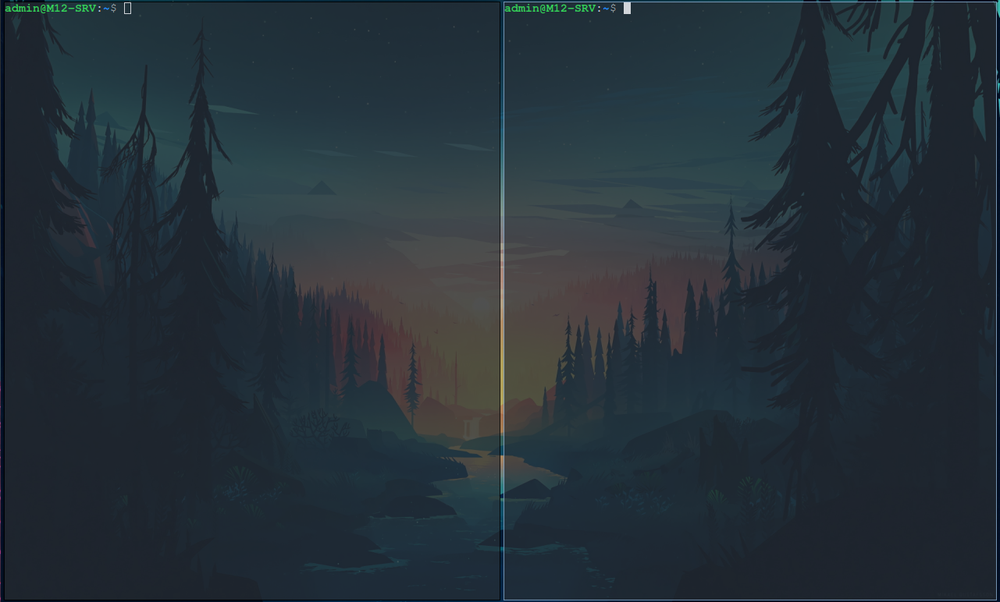

# Configuración de Alacritty



En esta guía explicaremos como configurar [Alacritty](https://wiki.archlinux.org/title/Alacritty) y como está organizado su directorio y sus ficheros

## Archivo de Configuración
En el [archivo de configuración](https://github.com/MarioCuenca22/Sintesis-M12/blob/b9f46349dba16b764cce773e10d03897499fa5c4/Cl%C3%BAster%20de%20Almacenamiento%20-%20Arch%20Linux/.config/alacritty/alacritty.toml) tenemos infinidad de variables y personalizaciones. Podéis hechar un ojo a todas las posibilidades en la [página oficial](https://alacritty.org/config-alacritty.html) de alacritty.

En nuestro caso, únicamente hemos configurado el tema, haciendolo con la variable import y la ruta del archivo *.toml*, y la opacidad de la terminal:

```bash
import = ['/home/admin/.config/alacritty/themes/one_dark.toml']

[window]
opacity = 0.8
```

Para que los cambios se apliquen, deberemos de haber instalado [picom](https://wiki.archlinux.org/title/picom), tal y como se ha explicado en la guía de [Configuración de Arch](https://github.com/MarioCuenca22/Sintesis-M12/blob/b9f46349dba16b764cce773e10d03897499fa5c4/Cl%C3%BAster%20de%20Almacenamiento%20-%20Arch%20Linux/README.md).


## Temas
En el [directorio](https://github.com/MarioCuenca22/Sintesis-M12/tree/b9f46349dba16b764cce773e10d03897499fa5c4/Cl%C3%BAster%20de%20Almacenamiento%20-%20Arch%20Linux/.config/alacritty/themes) de temas tenemos bastantes temas diferentes que podemos cambiar, manualmente al archivo de configuración de alacritty, tal y como hemos comentado en el apartado anterior, o con el script que hemos creado y el comando personalizado **change-term-theme**, que explicaremos en el siguiente apartado. 

Podemos descargar nuevos temas, siempre que los metamos en su directorio pertinente, desde este [repositorio](https://github.com/alacritty/alacritty-theme)


## Script
Hemos creado un script que nos permite automatizar la selección de temas. Lo que hace el script es recorrer el [directorio de temas](https://github.com/MarioCuenca22/Sintesis-M12/tree/b9f46349dba16b764cce773e10d03897499fa5c4/Cl%C3%BAster%20de%20Almacenamiento%20-%20Arch%20Linux/.config/alacritty/themes) y guardarlos en un diccionario, con un número como Identificador y el nombre. Finalmente nos lista las posibilidades, y cambia la primera línea del [archivo de configuración](https://github.com/MarioCuenca22/Sintesis-M12/blob/b9f46349dba16b764cce773e10d03897499fa5c4/Cl%C3%BAster%20de%20Almacenamiento%20-%20Arch%20Linux/.config/alacritty/alacritty.toml), que es donde importamos el tema y lo aplicamos.

Para que funcione, necesitamos instalar python, pip y colorama (Está explicado en la [guía de configuración de Arch](https://github.com/MarioCuenca22/Sintesis-M12/blob/b9f46349dba16b764cce773e10d03897499fa5c4/Cl%C3%BAster%20de%20Almacenamiento%20-%20Arch%20Linux/README.md))

```bash
sudo pacman -S python3 python3-pip python-colorama
```

Además, para evitar tener que escribir **python3 /home/admin/.config/alacritty/scripts/change-theme.py**, crearemos un alias en el archivo [.bashrc](https://github.com/MarioCuenca22/Sintesis-M12/blob/b9f46349dba16b764cce773e10d03897499fa5c4/Cl%C3%BAster%20de%20Almacenamiento%20-%20Arch%20Linux/.bashrc) (Está explicado en la [guía de configuración de Arch](https://github.com/MarioCuenca22/Sintesis-M12/blob/b9f46349dba16b764cce773e10d03897499fa5c4/Cl%C3%BAster%20de%20Almacenamiento%20-%20Arch%20Linux/README.md))

```bash
alias change-term-theme="/usr/bin/python3 /home/admin/.config/alacritty/scripts/change_theme.py"
```

Ahora, simplemente nos bastará con reinciar, y una vez el sistema vuelva a estar encendido, probaremos lo siguente:

```bash
change-term-theme
```
